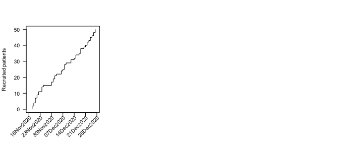
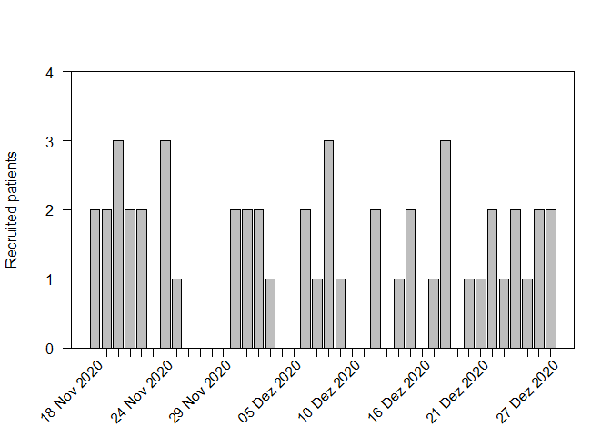
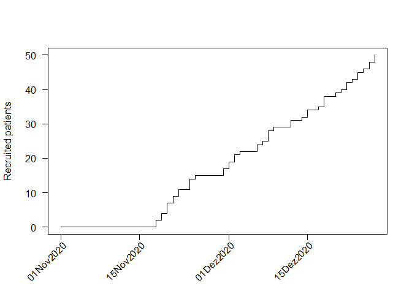
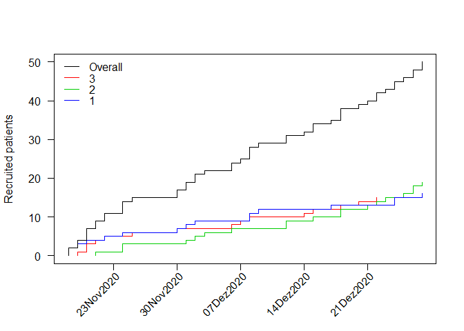
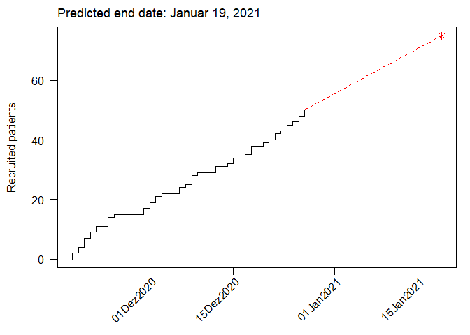

<!-- README.md is generated from README.Rmd. Please edit that file -->

`accrualPlot`
=============

<!--   -->

<!--  -->
<!--  -->
<!--  -->

Accrual plots are an important tool when monitoring clinical trials.
Some trials are terminated early due to low accrual, which is a waste of
resources (including time). Assessing accrual rates can also be useful
for planning analyses and estimating how long a trial needs to continue
recruiting participants. `accrualPlot` provides tools for such plots

Installation
------------

<!-- `accrualPlot` can be installed from CRAN in the usual manner: -->

You can install the development version of `accrualPlot` from github
with:

    # install.packages("remotes")
    remotes::install_github("CTU-Bern/accrualPlot")

Note that `remotes` treats any warnings (e.g. that a certain package was
built under a different version of R) as errors. If you see such an
error, run the following line and try again:

    Sys.setenv(R_REMOTES_NO_ERRORS_FROM_WARNINGS = "true")

Overview
--------

The first step to using `accrualPlot` is to create an accrual dataframe.
This is simply a dataframe with a counts of participants included per
day.

    # load package
    library(accrualPlot)
    #> Loading required package: lubridate
    #> 
    #> Attaching package: 'lubridate'
    #> The following objects are masked from 'package:base':
    #> 
    #>     date, intersect, setdiff, union

    # generate some data
    set.seed(1234)
    x <- as.Date("2020-12-07") + sample(c(-20:20), 50, replace = TRUE)

    df <- accrual_create_df(x)

Cumulative recruitment

    plot(df)

    # accrual_plot_cum(df)

Recruitment per day

    plot(df, which = "abs", unit = "day")

    # accrual_plot_abs(df, unit = "day")

If we know that we started recruiting on the 1st November, we can add
this information.

    # accrual_plot_cum(df, start_date = as.Date("2020-11-01"))
    plot(df, start_date = as.Date("2020-11-01"))

Multiple sites can also be depicted…

    site <- sample(1:3, 50, replace = TRUE)
    df2 <- accrual_create_df(x, by = site)
    # accrual_plot_cum(df2)
    plot(df2)

It is also possible to predict the time point at which a certain number
of participants has been recruited (for estimating when a study will be
complete). If we want to recruit a total of 75 participants, we can put
that in the `target` option.

    accrual_plot_predict(df, target = 75)
    # accrual_plot_predict(df2, target = 75) # does not seem to work
    plot(df, "predict", target = 75)

Table of recruitment, with or without a descriptive header.

    # accrual_table(df) 
    summary(df) 
    #>            start_date            time                    n
    #>  First participant in Months accruing Participants accrued
    #>             18Nov2020               1                   50
    #>                      rate
    #>  Accrual rate (per month)
    #>                     38.46
    summary(df2) 
    #>     name           start_date            time                    n
    #>   Center First participant in Months accruing Participants accrued
    #>        3            19Nov2020               1                   15
    #>        2            21Nov2020               1                   19
    #>        1            18Nov2020               1                   16
    #>  Overall            18Nov2020               1                   50
    #>                      rate
    #>  Accrual rate (per month)
    #>                     13.64
    #>                     15.83
    #>                     12.31
    #>                     38.46
    summary(df2, header = FALSE) 
    #>     name start_date time  n  rate
    #>        3  19Nov2020    1 15 13.64
    #>        2  21Nov2020    1 19 15.83
    #>        1  18Nov2020    1 16 12.31
    #>  Overall  18Nov2020    1 50 38.46
