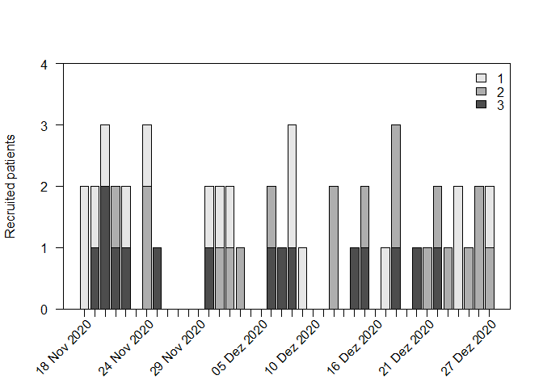

<!-- README.md is generated from README.Rmd. Please edit that file -->

`accrualPlot`
=============

<!--   -->

<!--  -->
<!--  -->
<!--  -->

Accrual plots are an important tool when monitoring clinical trials.
Some trials are terminated early due to low accrual, which is a waste of
resources (including time). Assessing accrual rates can also be useful
for planning analyses and estimating how long a trial needs to continue
recruiting participants. `accrualPlot` provides tools for such plots

Installation
------------

<!-- `accrualPlot` can be installed from CRAN in the usual manner: -->

You can install the development version of `accrualPlot` from github
with:

    # install.packages("remotes")
    remotes::install_github("CTU-Bern/accrualPlot")

Note that `remotes` treats any warnings (e.g. that a certain package was
built under a different version of R) as errors. If you see such an
error, run the following line and try again:

    Sys.setenv(R_REMOTES_NO_ERRORS_FROM_WARNINGS = "true")

Overview
--------

The first step to using `accrualPlot` is to create an accrual dataframe.
This is simply a dataframe with a counts of participants included per
day.

    # load package
    library(accrualPlot)
    #> Loading required package: lubridate
    #> 
    #> Attaching package: 'lubridate'
    #> The following objects are masked from 'package:base':
    #> 
    #>     date, intersect, setdiff, union

    # generate some data
    set.seed(1234)
    x <- as.Date("2020-12-07") + sample(c(-20:20), 50, replace = TRUE)

    df <- accrual_create_df(x)

Cumulative recruitment

    plot(df, which = "cum")

    # accrual_plot_cum(df)

Recruitment per day

    plot(df, which = "abs", unit = "day")

If we know that we started recruiting on the 1st November, we can add
this information.

    df2 <- accrual_create_df(x, start_date = as.Date("2020-11-01"))
    plot(df2)

Multiple sites can also be depicted…

    site <- sample(1:3, 50, replace = TRUE)
    df3 <- accrual_create_df(x, by = site)
    plot(df3)

    plot(df3, which = "abs", unit = "day")

It is also possible to predict the time point at which a certain number
of participants has been recruited (for estimating when a study will be
complete). If we want to recruit a total of 75 participants, we can put
that in the `target` option.

    plot(df, "predict", target = 75)

Table of recruitment, with or without a descriptive header.

    # accrual_table(df) 
    summary(df, unit = "day") 
    #>            start_date          time                    n                   rate
    #>  First participant in Days accruing Participants accrued Accrual rate (per day)
    #>             18Nov2020            39                   50                   1.28
    summary(df2, unit = "day") 
    #>            start_date          time                    n                   rate
    #>  First participant in Days accruing Participants accrued Accrual rate (per day)
    #>             18Nov2020            39                   50                   1.28
    summary(df3, unit = "day") 
    #>     name           start_date          time                    n
    #>   Center First participant in Days accruing Participants accrued
    #>        1            18Nov2020            39                   16
    #>        2            21Nov2020            36                   19
    #>        3            19Nov2020            38                   15
    #>  Overall            18Nov2020            39                   50
    #>                    rate
    #>  Accrual rate (per day)
    #>                    0.41
    #>                    0.53
    #>                    0.39
    #>                    1.28
    summary(df3, unit = "day", header = FALSE) 
    #>     name start_date time  n rate
    #>        1  18Nov2020   39 16 0.41
    #>        2  21Nov2020   36 19 0.53
    #>        3  19Nov2020   38 15 0.39
    #>  Overall  18Nov2020   39 50 1.28
