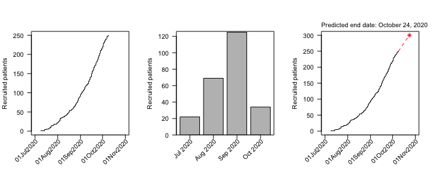

<!-- README.md is generated from README.Rmd. Please edit that file -->

# `accrualPlot` 

[](https://cran.r-project.org/package=accrualPlot)
[](https://github.com/CTU-Bern/accrualPlot)
[](https://github.com/CTU-Bern/accrualPlot/actions)
[](https://cran.r-project.org/package=accrualPlot)
<!--  -->
<!-- [](https://ci.appveyor.com/project/CTU-Bern/presize) -->
<!-- [](https://codecov.io/github/CTU-Bern/accrualPlot) -->

Accrual plots are an important tool when monitoring clinical trials.
Some trials are terminated early due to low accrual, which is a waste of
resources (including time). Assessing accrual rates can also be useful
for planning analyses and estimating how long a trial needs to continue
recruiting participants. `accrualPlot` provides tools for such plots

## Installation

`accrualPlot` can be installed from CRAN in the usual manner:

``` r
install.packages('accrualPlot')
```

The development version of the package can be installed from the CTU
Bern universe via

``` r
install.packages('accrualPlot', repos = 'https://ctu-bern.r-universe.dev')
```

`accrualPlot` can be installed directly from from github with:

``` r
# install.packages("remotes")
remotes::install_github("CTU-Bern/accrualPlot")
```

Note that `remotes` treats any warnings (e.g. that a certain package was
built under a different version of R) as errors. If you see such an
error, run the following line and try again:

``` r
Sys.setenv(R_REMOTES_NO_ERRORS_FROM_WARNINGS = "true")
```

## Overview

The first step to using `accrualPlot` is to create an accrual dataframe.
This is simply a dataframe with a counts of participants included per
day.

``` r
# load package
library(accrualPlot)
#> Loading required package: lubridate
#> 
#> Attaching package: 'lubridate'
#> The following objects are masked from 'package:base':
#> 
#>     date, intersect, setdiff, union

# demonstration data
data(accrualdemo)

df <- accrual_create_df(accrualdemo$date)
```

Cumulative and absolute recruitment plots , as well as a method to
predict the time point of study completion, are included.

``` r
par(mfrow = c(1,3))
plot(df, which = "cum")
plot(df, which = "abs")
plot(df, which = "pred", target = 300)
```

<!-- -->

### Acknowledgements

The package logo was created with
[`ggplot2`](https://ggplot2.tidyverse.org/) and
[`hexSticker`](https://github.com/GuangchuangYu/hexSticker) with icons
from [Font Awesome](https://fontawesome.com/) (via the [emojifont
package](https://github.com/GuangchuangYu/emojifont)).
