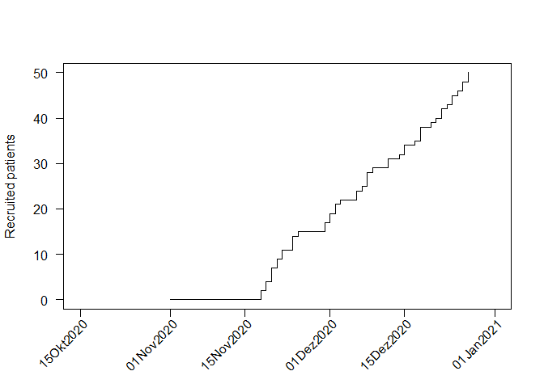
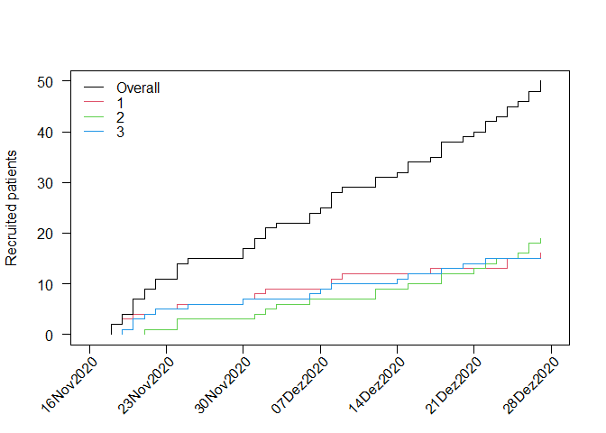
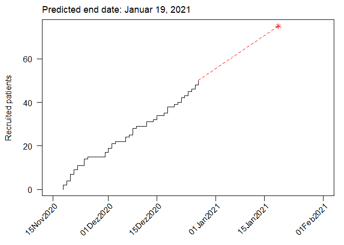

<!-- README.md is generated from README.Rmd. Please edit that file -->

# `accrualPlot`

<!-- [](https://cran.r-project.org/package=accrualPlot)  -->

[](https://github.com/CTU-Bern/accrualPlot)
<!--  -->
<!-- [](https://ci.appveyor.com/project/CTU-Bern/presize) -->
[](https://github.com/CTU-Bern/presize/actions)
<!-- [](https://codecov.io/github/CTU-Bern/accrualPlot) -->

Accrual plots are an important tool when monitoring clinical trials.
Some trials are terminated early due to low accrual, which is a waste of
resources (including time). Assessing accrual rates can also be useful
for planning analyses and estimating how long a trial needs to continue
recruiting participants. `accrualPlot` provides tools for such plots

## Installation

<!-- `accrualPlot` can be installed from CRAN in the usual manner: -->

You can install the development version of `accrualPlot` from github
with:

``` r
# install.packages("remotes")
remotes::install_github("CTU-Bern/accrualPlot")
```

Note that `remotes` treats any warnings (e.g. that a certain package was
built under a different version of R) as errors. If you see such an
error, run the following line and try again:

``` r
Sys.setenv(R_REMOTES_NO_ERRORS_FROM_WARNINGS = "true")
```

## Overview

The first step to using `accrualPlot` is to create an accrual dataframe.
This is simply a dataframe with a counts of participants included per
day.

``` r
# load package
library(accrualPlot)
#> Loading required package: lubridate
#> 
#> Attaching package: 'lubridate'
#> The following object is masked from 'package:base':
#> 
#>     date

# generate some data
set.seed(1234)
x <- as.Date("2020-12-07") + sample(c(-20:20), 50, replace = TRUE)

df <- accrual_create_df(x)
```

Recruitment per day

``` r
accrual_plot_abs(df, unit = "day")
```

<!-- -->

Cumulative recruitment

``` r
accrual_plot_cum(df)
```

<!-- -->

If we know that we started recruiting on the 1st November, we can add
this information.

``` r
accrual_plot_cum(df, start_date = as.Date("2020-11-01"))
```

<!-- -->

Multiple sites can also be depicted…

``` r
site <- sample(1:3, 50, replace = TRUE)
df2 <- accrual_create_df(x, by = site)
accrual_plot_cum(df2)
```

<!-- -->

It is also possible to predict the time point at which a certain number
of participants has been recruited (for estimating when a study will be
complete). If we want to recruit a total of 75 participants, we can put
that in the `target` option.

``` r
accrual_plot_predict(df, target = 75)
```

<!-- -->

``` r
# accrual_plot_predict(df2, target = 75) # does seem to work
```

``` r
accrual_table(df) # doesnt seem to work
```
